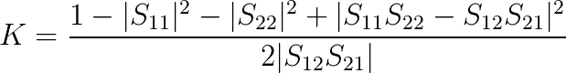
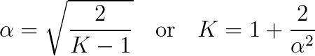
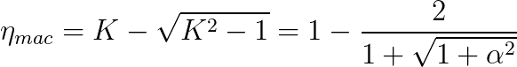

# Introduction
WIPL-D

I usually run parametric simulation using the sweep function and it is very hard to export the values when the number of step is big.

# Structure
The WIPL-D file containing the results has the *.ad1* extension

A single row in the [z/s/y]param_filename looks like

| Sweep parameter name | Sweep parameter value | Frequency Unit | Frequency value | real(z/s_11) | imag(z/s_11) | real(z/s_12) | imag(z/s_12) | real(z/s_21) | imag(z/s_21) | real(z/s_22) | imag(z/s_22) |
| -------------------- | --------------------- | -------------- | --------------- | ------------ | ------------ | ------------ | ------------ | ------------ | ------------ | ------------ | ------------ |
|      mvstep                |              0       | MHz  |      27.12          |  -0.904291450977325               |    0.0404188111424446          |  0.00347811472602189            | 0.163365587592125 | 0.00346626085229218 | 0.162827968597412 | 0.162827968597412 | -0.000294928031507879 |

According to Prof. Ohira, in the  maximum achievable efficiency could be obtained by:
- Z-parameters
$$K = \frac{1-|S_{11}|^2-|S_{22}|^2+|S_{11}S_{22}-S_{12}S_{21}|^2}{2|S_{12}S_{21}|}$$
- S-parameters[^1]

By forcing s_12 = s_21, a new parameter \alpha has been introduced:

So:

# TODO
- [X] Implement the [Z/S/Y]-parameters resultExporter for up to 2 generators (tx/rx)
- [X] Export the maximum achievable efficiency using prof Ohira formulation for from Z/S-parameters
- [ ] Implement the [Z/S/Y]-parameters resultExporter for more than 2 generators
- [ ] Implement the current results in order to compute the real efficiency

Source
[^1]: Ohira, Takashi. “Extended k-Q product formulas for capacitive- and inductive-coupling wireless power transfer schemes.” *IEICE Electronic Express* 11 (2014): 20140147.